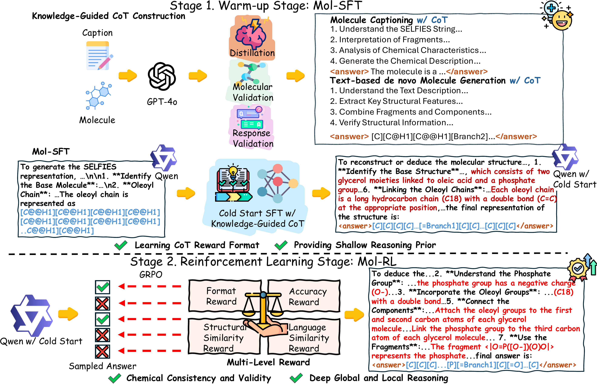

<p align="center">
  <h1 align="center">MolReasoner: Toward Effective and Interpretable Reasoning for Molecular LLMs</h1>
    <p align="center">
  📖<a href="https://arxiv.org/abs/2508.02066">Paper</a> |
  🤗<a href="https://huggingface.co/datasets/guojianz/MolReasoner">Datasets</a> | 
  🤗<a href="https://huggingface.co/guojianz/MolReasoner">Models Weights (Huggingface)</a> | 
  🤖<a 
  href="https://modelscope.cn/models/cody545487677/MolReasoner/">Models Weights (ModelScope)</a></h3>
<div align="center"></div>
<p align="center">
  <p>

🌈Large Language Models (LLMs) have demonstrated remarkable performance across various domains, yet their capabilities in molecular reasoning remain insufficiently explored. Current approaches tend to rely heavily on general-purpose prompting, which lacks domain-specific molecular semantics, while those that use fine-tuning strategies often face challenges with interpretability and reasoning depth. To address these issues, we introduce **MolReasoner**, a two-stage framework designed to transition LLMs from memorization towards chemical reasoning. First, we propose Mol-SFT, which initializes the model’s reasoning abilities via synthetic Chain-of-Thought (CoT) samples generated by GPT-4o and verified for chemical accuracy. Subsequently, Mol-RL applies reinforcement learning with specialized reward functions designed explicitly to align chemical structures with linguistic descriptions, thereby enhancing molecular reasoning capabilities. Our approach notably enhances interpretability, improving the model’s molecular understanding and enabling better generalization. Extensive experiments demonstrate that MolReasoner outperforms existing methods, and marking a significant shift from memorization-based outputs to robust chemical reasoning.
The illustrations are shown below:
<a href="">

</a>

## 📢 News

<!-- - 🚀 [08/04/2025] Our paper **Visual-RFT** is accepted by ICCV 2025!
- 🚀 [05/21/2025] We support both **HuggingFace Dataset** format and **JSON** file format as input datasets for training.
- 🚀 [05/21/2025] We updata the trainer of **Visual-RFT** to support both Qwen2-VL and Qwen2.5-VL. And we support multi-image inputs with `grpo_trainer_mp.py`.
- 🚀 [05/20/2025] We release **Visual-ARFT** repository <a href="https://github.com/Liuziyu77/Visual-RFT/tree/main/Visual-ARFT">Repo-URL</a>: A RFT framework dedicated to enhancing the **multimodal agentic capabilities of LVLMs**. (Support Qwen2-VL and Qwen2.5-VL)
- 🚀 [03/12/2025] We release the code of **Visual-RFT** to build the <a href="https://github.com/Liuziyu77/Visual-RFT/tree/main/dataset">dataset</a> on your own data.


- 🚀 [03/04/2025] We release our **Visual-RFT's** <a href="https://arxiv.org/abs/2503.01785">Paper</a>. -->

- 🚀 [08/05/2025] We release our **MolReasoner's** <a href="https://arxiv.org/abs/2508.02066">Paper</a>.
- 🚀 [08/05/2025] We upload our checkpoints of **MolReasoner** to <a href="https://huggingface.co/guojianz/MolReasoner">Huggingface</a>.
- 🚀 [08/04/2025] We upload our checkpoints of **MolReasoner** to <a href="https://modelscope.cn/models/cody545487677/MolReasoner/">ModelScope</a>.
- 🚀 [08/04/2025] We upload our training datasets of **MolReasoner** to <a href="https://huggingface.co/datasets/guojianz/MolReasoner">Huggingface</a>.
- 🚀 [08/04/2025] We release **MolReasoner** repository and our training, inference and evaluation code.

## 🛠️ Setup

```
# 1. Install LLaMA-Factory from https://github.com/hiyouga/LLaMA-Factory repository.
# 2. Install Verl from https://github.com/volcengine/verl repository.
# 3. Install additional dependencies for both environments
pip3 install deepspeed
pip install --force-reinstall psutil==5.9.8
pip install -U "ray[data,train,tune,serve,default]"
pip install EFGs
pip install swanlab
pip install --upgrade boto3 botocore
pip install rdkit tensorboard
pip install python-Levenshtein
pip install selfies
pip install nltk

# 4. Configure NLTK data path
cp -r verl/nltk_data /root/nltk_data

# 5. Download the SciBERT model
# Download the SciBERT model from Hugging Face:
# https://huggingface.co/allenai/scibert_scivocab_uncased or
# https://huggingface.co/Sihangli/3D-MoLM


# 6. Download the QWEN 2.5-7B-Instruct model
# Download the QWEN 2.5-7B-Instruct model from Hugging Face:
# https://huggingface.co/Qwen/Qwen2.5-7B-Instruct

```

## Mol-SFT

### Data Preparation:

Please download the data from Hugging Face and place the corresponding SFT data under the `LLaMA-Factory/data` directory. Then, store the data according to the information in `LLaMA-Factory/data/dataset_info.json` as follows:

```json
{
  "text_based_de_novo_molecule_generation_train": {
    "file_name": "text_based_de_novo_molecule_generation_train.json"
  },
  "text_based_de_novo_molecule_generation_test": {
    "file_name": "text_based_de_novo_molecule_generation_test.json"
  },
  "molecule_captioning_train": {
    "file_name": "molecule_captioning_train.json"
  },
  "molecule_captioning_test": {
    "file_name": "molecule_captioning_test.json"
  }
}
```

### Model Training

```bash
# 1. Molecule Captioning
bash LLaMA-Factory/train_molecule_captioning.sh
# 2. Text-based De Novo Molecule Generation
bash LLaMA-Factory/train_text_based_de_novo_molecule_generation.sh
```

Please remember to update the base model paths (`Qwen2.5-7B-Instruct`) in the following YAML files:

- `LLaMA-Factory/examples/train_full/train_molecule_captioning/sft.yml`
- `LLaMA-Factory/examples/train_full/train_text_guided_molecule_generation/sft.yml`

Make sure to modify the paths to the downloaded model and adjust the save paths as needed.

## Mol-RL

### Data Preparation:

Please download the grpo data from Huggingface.

### Model Training

```bash
# 1. Molecule Captioning
bash verl/examples/grpo_trainer/grpo_train_molecule_captioning.sh
# 2. Text-based De Novo Molecule Generation
bash verl/examples/grpo_trainer/grpo_train_text_based_de_novo_molecule_generation.sh
```

Please make sure to follow the notes provided in the two shell files and update the paths accordingly.

Additionally, during the Molecule Captioning training, make sure to replace the line `primary_path = 'xxxx/scibert_scivocab_uncased'` in the file `verl/verl/utils/reward_score/chembl_mol2desc.py` with your own model path.

For convenience, in the code:

- `desc2mol` is set to refer to `text_guided_molecule_generation`, and
- `mol2desc` is set to refer to `molecule_captioning`.

### Merge Model

Please refer to `verl/scripts/model_merger.sh` to merge the trained actor model with the `Qwen2.5-7B-Instruct` model.

### Inference

Please refer to `LLaMA-Factory/infer_molecule_captioning.sh` and `LLaMA-Factory/infer_text_based_de_novo_molecule_generation.sh`. Make sure to replace the paths to the merged model and update the output paths for inference.

## Evaluation

We have provided scripts to evaluate both tasks, located at:

- `verl/examples/data_preprocess/molecule/molecule_captioning/eval_molecule_captioning/eval_metrics.py`
- `verl/examples/data_preprocess/molecule/text_guided_molecule_generation/eval_text_guided_molecule_generation/eval_metrics.py`

Additionally, to demonstrate the effectiveness, we have included several baseline examples as well as the metrics from our method in the following directories:

- `verl/examples/data_preprocess/molecule/molecule_captioning/eval_molecule_captioning/saved_results`

- `verl/examples/data_preprocess/molecule/text_guided_molecule_generation/eval_text_guided_molecule_generation/saved_results`

**To perform the metric evaluation, we have also provided some baseline evaluation scripts. The results here are exactly the same as those presented in our paper.**

```bash
python verl/examples/data_preprocess/molecule/molecule_captioning/eval_molecule_captioning/grpo_eval.py # MolReasoner Molecule Captioning Evaluation
python verl/examples/data_preprocess/molecule/molecule_captioning/eval_molecule_captioning/eval_mol_instruct.py # Mol-Instruction Molecule Captioning Evaluation
python verl/examples/data_preprocess/molecule/molecule_captioning/eval_molecule_captioning/eval_qwen2_5_7b.py # Qwen2.5-7B Molecule Captioning Evaluation
python verl/examples/data_preprocess/molecule/molecule_captioning/eval_molecule_captioning/eval_llama3_70b.py # Llama3-70B Molecule Captioning Evaluation
python verl/examples/data_preprocess/molecule/text_guided_molecule_generation/eval_text_guided_molecule_generation/grpo_eval.py # MolReasoner Text-based De Novo Molecule Generation Evaluation
```

## Results

<h3>📈 Molecule Captioning Performance</h3>
<p><em>MolReasoner outperforms all closed-source and open-source baselines across BLEU-2/4, METEOR, and ROUGE metrics, establishing a new state-of-the-art in the molecule captioning task.</em></p>
<table>
  <thead>
    <tr>
      <th style="text-align:left;">Method (Size)</th>
      <th>BLEU-2 ↑</th>
      <th>BLEU-4 ↑</th>
      <th>METEOR ↑</th>
      <th>ROUGE-1 ↑</th>
      <th>ROUGE-2 ↑</th>
      <th>ROUGE-L ↑</th>
    </tr>
  </thead>
  <tbody>
    <tr>
      <td colspan="7" align="center" style="font-weight:bold; background:#eef2f7;">Closed-Source Models</td>
    </tr>
    <tr>
      <td>GPT-4o (–)</td>
      <td>0.1194</td>
      <td>0.0433</td>
      <td>0.1651</td>
      <td>0.2315</td>
      <td>0.0738</td>
      <td>0.1792</td>
    </tr>
    <tr>
      <td>GPT-4o-mini (–)</td>
      <td>0.1080</td>
      <td>0.0400</td>
      <td>0.1545</td>
      <td>0.2310</td>
      <td>0.0723</td>
      <td>0.1776</td>
    </tr>
    <tr>
      <td colspan="7" align="center" style="font-weight:bold; background:#eef2f7;">Open-Source Models</td>
    </tr>
    <tr>
      <td>Qwen2.5-7B-Instruct (7B)</td>
      <td>0.0792</td>
      <td>0.0258</td>
      <td>0.2132</td>
      <td>0.2091</td>
      <td>0.0601</td>
      <td>0.1483</td>
    </tr>
    <tr>
      <td>DeepSeek-R1-Distill-Qwen-7B (7B)</td>
      <td>0.1173</td>
      <td>0.0469</td>
      <td>0.1544</td>
      <td>0.2209</td>
      <td>0.0749</td>
      <td>0.1693</td>
    </tr>
    <tr>
      <td>Llama3.1-8B-Intstruct (8B)</td>
      <td>0.1670</td>
      <td>0.0769</td>
      <td>0.2164</td>
      <td>0.2806</td>
      <td>0.1182</td>
      <td>0.2250</td>
    </tr>
    <tr>
      <td>Qwen3-8B (8B)</td>
      <td>0.0974</td>
      <td>0.0289</td>
      <td>0.1733</td>
      <td>0.2067</td>
      <td>0.0501</td>
      <td>0.1567</td>
    </tr>
    <tr>
      <td>Llama3.1-70B-Instruct (70B)</td>
      <td>0.1466</td>
      <td>0.0658</td>
      <td>0.1832</td>
      <td>0.2736</td>
      <td>0.1072</td>
      <td>0.2203</td>
    </tr>
    <tr>
      <td>Qwen2.5-72B-Instruct (72B)</td>
      <td>0.1519</td>
      <td>0.0647</td>
      <td>0.1949</td>
      <td>0.2729</td>
      <td>0.0948</td>
      <td>0.2067</td>
    </tr>
    <tr>
      <td>Mol-Instruction (7B)</td>
      <td>0.0956</td>
      <td>0.0667</td>
      <td>0.1891</td>
      <td>0.2801</td>
      <td>0.1823</td>
      <td>0.2582</td>
    </tr>
    <tr style="font-weight:bold; background:#d0d7df;">
      <td>MolReasoner (Ours) (7B)</td>
      <td>0.4383</td>
      <td>0.3220</td>
      <td>0.4754</td>
      <td>0.5530</td>
      <td>0.3662</td>
      <td>0.4821</td>
    </tr>
  </tbody>
</table>

<h3>📈 Text-based de novo Molecule Generation Performance</h3>
<p><em>MolReasoner surpasses both closed-source and open-source baselines across all metrics, achieving state-of-the-art performance in this molecule generation task.</em></p>
<table>
  <thead>
    <tr>
      <th style="text-align:left;">Method&nbsp;(Size)</th>
      <th>BLEU&nbsp;↑</th>
      <th>Exact&nbsp;↑</th>
      <th>Levenshtein&nbsp;↓</th>
      <th>RDK&nbsp;FTS&nbsp;↑</th>
      <th>MACCS&nbsp;FTS&nbsp;↑</th>
      <th>MORGAN&nbsp;FTS&nbsp;↑</th>
      <th>Frag-J&nbsp;↑</th>
      <th>Frag-R&nbsp;↑</th>
      <th>FG-Match&nbsp;↑</th>
      <th>VALIDITY&nbsp;↑</th>
    </tr>
  </thead>
  <tbody>
    <tr>
      <td colspan="11" align="center" style="font-weight:bold; background:#eef2f7;">Closed-Source&nbsp;Models</td>
    </tr>
    <tr>
      <td>GPT-4o&nbsp;(–)</td>
      <td>0.1949</td><td>0.0045</td><td>49.3545</td><td>0.0926</td>
      <td>0.2066</td><td>0.0836</td><td>0.1296</td><td>0.1777</td>
      <td>0.3753</td><td>0.2916</td>
    </tr>
    <tr>
      <td>GPT-4o-mini&nbsp;(–)</td>
      <td>0.0522</td><td>0.0058</td><td>49.1371</td><td>0.0863</td>
      <td>0.2032</td><td>0.0883</td><td>0.0987</td><td>0.1324</td>
      <td>0.3898</td><td>0.1946</td>
    </tr>
    <tr>
      <td colspan="11" align="center" style="font-weight:bold; background:#eef2f7;">Open-Source&nbsp;Models</td>
    </tr>
    <tr>
      <td>Qwen2.5-7B-Instruct&nbsp;(7B)</td>
      <td>0.0002</td><td>0.0024</td><td>40.0076</td><td>0.0776</td>
      <td>0.1585</td><td>0.0520</td><td>0.0773</td><td>0.1037</td>
      <td>0.3601</td><td>0.2395</td>
    </tr>
    <tr>
      <td>DeepSeek-R1-Distill-Qwen-7B&nbsp;(7B)</td>
      <td>0.0000</td><td>0.0018</td><td>50.6957</td><td>0.0619</td>
      <td>0.1327</td><td>0.0461</td><td>0.1101</td><td>0.1428</td>
      <td>0.3847</td><td>0.0697</td>
    </tr>
    <tr>
      <td>Llama3.1-8B-Intstruct&nbsp;(8B)</td>
      <td>0.0094</td><td>0.0027</td><td>40.2092</td><td>0.0556</td>
      <td>0.1470</td><td>0.0470</td><td>0.0701</td><td>0.0918</td>
      <td>0.3587</td><td>0.2319</td>
    </tr>
    <tr>
      <td>Qwen3-8B&nbsp;(8B)</td>
      <td>0.0000</td><td>0.0036</td><td>28.2564</td><td>0.3692</td>
      <td>0.4733</td><td>0.3059</td><td>0.3406</td><td>0.3566</td>
      <td>0.5280</td><td>0.0118</td>
    </tr>
    <tr>
      <td>Llama3.1-70B-Instruct&nbsp;(70B)</td>
      <td>0.0787</td><td>0.0055</td><td>44.1626</td><td>0.0824</td>
      <td>0.2323</td><td>0.0785</td><td>0.1398</td><td>0.1963</td>
      <td>0.3574</td><td>0.4641</td>
    </tr>
    <tr>
      <td>Qwen2.5-72B-Instruct&nbsp;(72B)</td>
      <td>0.0000</td><td>0.0048</td><td><strong>18.0588</strong></td><td>0.1584</td>
      <td>0.3456</td><td>0.1432</td><td>0.1696</td><td>0.2300</td>
      <td>0.3436</td><td><strong>0.1134</strong></td>
    </tr>
    <tr>
      <td>Mol-Instruction&nbsp;(7B)</td>
      <td>0.3049</td><td>0.0470</td><td>39.4268</td><td>0.2914</td>
      <td>0.4427</td><td>0.2524</td><td>0.3333</td><td>0.4092</td>
      <td>0.4324</td><td><strong>0.9994</strong></td>
    </tr>
    <tr style="font-weight:bold; background:#d0d7df;">
      <td>MolReasoner&nbsp;(Ours)&nbsp;(7B)</td>
      <td><strong>0.7841</strong></td><td><strong>0.0758</strong></td><td><strong>26.9255</strong></td>
      <td><strong>0.4373</strong></td><td><strong>0.6759</strong></td><td><strong>0.3627</strong></td>
      <td><strong>0.5213</strong></td><td><strong>0.6414</strong></td><td><strong>0.5390</strong></td>
      <td><strong>0.9679</strong></td>
    </tr>
  </tbody>
</table>

## 🔭 Outlook

While MolReasoner makes significant strides toward interpretable and effective molecular reasoning—bridging CoT-style supervision with chemistry-aware reinforcement learning—there remains ample room for exploration. In future work, we plan to:

- **Broaden Task Coverage:** Extend MolReasoner to additional molecular tasks (e.g. property prediction, retrosynthesis planning) and richer input modalities (e.g. 3D conformers, reaction schemes).
- **Enhance Reward Design:** Incorporate experimentally grounded metrics—such as synthetic accessibility, reaction feasibility, and bioactivity scores—into our multi-level rewards to further align model outputs with real-world chemistry.
- **Scale and Efficiency:** Investigate more efficient training strategies (e.g. off-policy RL, distillation) and adapt MolReasoner to larger LLM backbones without prohibitive compute costs.
- **Robustness & Fairness:** Evaluate model performance on out-of-distribution and negatively biased datasets, and develop techniques to mitigate hallucinations and semantic drift in generated reasoning chains.

We hope MolReasoner not only serves as a strong baseline but also inspires the community to push the boundaries of molecular LLMs—fostering new ideas, benchmarks, and open-source collaborations aimed at truly autonomous chemical reasoning.

## ✒️Citation

```
@misc{zhao2025molreasonereffectiveinterpretablereasoning,
      title={MolReasoner: Toward Effective and Interpretable Reasoning for Molecular LLMs},
      author={Guojiang Zhao and Sihang Li and Zixiang Lu and Zheng Cheng and Haitao Lin and Lirong Wu and Hanchen Xia and Hengxing Cai and Wentao Guo and Hongshuai Wang and Mingjun Xu and Siyu Zhu and Guolin Ke and Linfeng Zhang and Zhifeng Gao},
      year={2025},
      eprint={2508.02066},
      archivePrefix={arXiv},
      primaryClass={cs.LG},
      url={https://arxiv.org/abs/2508.02066},
}
```

## Acknowledgement

We sincerely thank projects <a href="https://github.com/hiyouga/LLaMA-Factory">LLaMA-Factory</a>, <a href="https://github.com/volcengine/verl">Verl</a>, <a href="https://github.com/zjunlp/Mol-Instructions">Mol-Instructions</a>, and <a href="https://github.com/Liuziyu77/Visual-RFT/blob/main">Visual-RFT</a> for providing their open-source resources.

## ⭐ Star History

[](https://www.star-history.com/#545487677/MolReasoner&Date)
